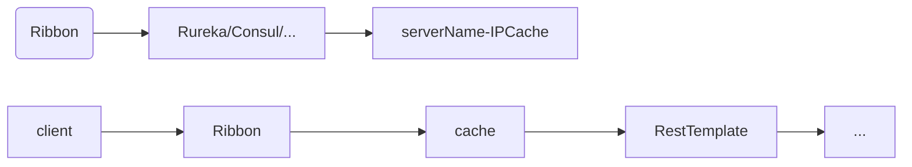

# SpringCloud服务间通信

讲讲服务间通信的方式~                                                                                                                                                                                                                                                                                                                                                                                                                                                                                                                                                                                                                                                                                                                                                                                                                                                          

## RestTemplate

### 概述

Spring框架为我们提供了RestTemplate类，简化了http服务的通信方式，统一了RestFul风格，封装了http链接，我需要一个url及返回值即可调用其他服务。

### 实践

创建两个SpringBoot项目，注册到服务注册中心consul上，快速开发Controller

服务1：

* 端口号8888

```java
@Controller
public class TestController {:
    @GetMapping
    @ResponseBody
    public String test() {
        return "I am restTemplate1";
    }
}
```

服务2：

* 端口号为9999
* 新建RestTemplate对象，使用对象的getForObject方法，参数为url和返回值的类型即可调用服务1中的方法

```java
@Controller
public class TestController {
    @GetMapping
    @ResponseBody
    public String test() {
        RestTemplate restTemplate = new RestTemplate();
        String result = restTemplate.getForObject("http://localhost:8888", String.class);
        return result;
    }
}
```

### 常用方法

#### GET

```java
// 请求地址、返回值类型、请求参数（一一对应）
public T getForObject(String url, Class responseType, Object… uriVariables) {...}

public T getForObject(String url, Class responseType, Map<String, ?> uriVariables) {...}

public T getForObject(URI url, Class responseType) {...}

public ResponseEntity getForEntity(String url, Class responseType, Object… uriVariables) {...}

public ResponseEntity getForEntity(String url, Class responseType, Map<String, ?> uriVariables) {...}

public ResponseEntity getForEntity(URI url, Class responseType) {...}

//getForEntity的返回值含完整的信息，而getForObject只有响应体

// 状态信息
HttpStatus statusCode = entity.getStatusCode();
// 状态码
int statusCodeValue = entity.getStatusCodeValue();
// 响应头
HttpHeaders headers = entity.getHeaders();
// 响应体
CommonResult body = entity.getBody();
```

#### POST

post方法比get方法多了个request参数，也有postForEntity

```java
//返回参数为uri，为重定向的uri，表示新资源的位置
public <T> T postForObject(String url, @Nullable Object request, Class<T> responseType, Object... uriVariables) {...}

public <T> T postForObject(String url, @Nullable Object request, Class<T> responseType, Map<String, ?> uriVariables) {...}

public <T> T postForObject(URI url, @Nullable Object request, Class<T> responseType) {...}

//关于request
//请求头设置,x-www-form-urlencoded格式的数据
HttpHeaders headers = new HttpHeaders();
headers.setContentType(MediaType.APPLICATION_FORM_URLENCODED);

//提交参数设置
MultiValueMap<String, String> map = new LinkedMultiValueMap<>();
map.add("title", "zimug 发布文章第二篇");
map.add("body", "zimug 发布文章第二篇 测试内容");

//组装请求体
HttpEntity<MultiValueMap<String, String>> request =
    new HttpEntity<MultiValueMap<String, String>>(map, headers);

//发送post请求，并打印结果，以String类型接收响应结果JSON字符串
String result = restTemplate.postForObject(url, request, String.class);
```

#### PUT、Patch

和post差不多，没有返回值，不赘述

#### DELETE

```java
//表删除、无返回值
public void delete(String url, Object… uriVariables) {...}

public void delete(String url, Map<String, ?> uriVariables) {...}

public void delete(URI url) {...}
```

#### optionsForAllow

```java
//参数和delete一致，返回可执行的方法的set集合
public Set optionsForAllow(...) {...}
```

#### exchange

exchange方法提供统一的方法模板进行请求

```java
public ResponseEntity exchange(String url, HttpMethod method,@Nullable HttpEntity<?> requestEntity, Class responseType, Object… uriVariables) {...}

public ResponseEntity exchange(String url, HttpMethod method,@Nullable HttpEntity<?> requestEntity, Class responseType ,Map<String, ?> uriVariables ) {...}

public ResponseEntity exchange(URI url, HttpMethod method, @Nullable HttpEntity<?> requestEntity, Class responseType) {...}

public ResponseEntity exchange(String url, HttpMethod method, @Nullable HttpEntity<?> requestEntity, ParameterizedTypeReference responseType, Object… uriVariables) {...}

public ResponseEntity exchange(String url, HttpMethod method, @Nullable HttpEntity<?> requestEntity, ParameterizedTypeReference responseType, Map<String, ?> uriVariables) {...}

public ResponseEntity exchange(URI url, HttpMethod method, @Nullable HttpEntity<?> requestEntity, ParameterizedTypeReference responseType) {...}

public ResponseEntity exchange(RequestEntity<?> requestEntity, ParameterizedTypeReference responseType) {...}

public ResponseEntity exchange(RequestEntity<?> requestEntity, Class responseType) {...}

// HttpMethod：GET, HEAD, POST, PUT, PATCH, DELETE, OPTIONS, TRACE
// HttpEntity：分请求头（类型为MultiValueMap）、请求体（类型为 T ）
```


## Ribbon

### 概述

使用RestTemplate时，调用其他服务的时候，请求url被写死在方法中，**无法实现负载均衡**，且如果被调用服务的服务路径被改变时，**维护会变得很麻烦**。

Spring Cloud Ribbon是一个基于HTTP和TCP的**客户端负载均衡工具**，它基于Netflix Ribbon实现。通过Spring Cloud的封装，可以让我们轻松地将面向服务的REST模版请求自动转换成客户端负载均衡的服务调用。

目前Ribbon**已停止维护**。

**注：Ribbon只是利用服务注册中心实现负载均衡，发请求的还是RestTemplate！**



### 实践1——获取实例

1. 复用RestTemplate的两个服务，再复制启动一个SpringBoot项目，端口为11111，服务名设置为与9999相同（代表同一类服务）

2. 引入依赖，注：**eureka和consul已经集成了ribbon组件，无需手动引入**

   ```xml
   <dependency>
     <groupId>org.springframework.cloud</groupId>
     <artifactId>spring-cloud-starter-netflix-ribbon</artifactId>
   </dependency>
   ```

3. 两种类型的对象，注入：DiscoveryClient、LoadBalancerClient

   ```java
   @Autowired
   DiscoveryClient discoveryClient;
   
   @Autowired
   LoadBalancerClient loadBalancerClient;
   ```

4. DiscoveryClient**获取实例列表**，实际调用策略是我们自己定义；而LoadBalancerClient有负载均衡策略（默认轮询），直接**获取一个实例**

   ```java
   public void test() {
       //获取实例列表
       List<ServiceInstance> list = discoveryClient.getInstances("RESTTEMPLATE2");
       list.forEach(service -> {
           service.getHost();
           service.getPort();
           service.getUri();
       });
       
       //获取一个实例（通过负载均衡算法）
       ServiceInstance instance = loadBalancerClient.choose("RESTTEMPLATE2");
       System.out.println(instance.getHost() + ":" + instance.getPort() + ", " + instance.getUri());
   }
   ```

5. 通过获取的实例地址和端口或url，再使用RestTemplate去调用服务（即discoveryClient、loadBalancerClient只是获取实例，**并不能帮我们发送HTTP请求**）

### 实例2——加强RestTemplate

1. 新建配置类，整合RestTemplate和Ribbon

   ```java
   @Configuration
   public class RestTemplateConfig {
       
       @Bean
       @LoadBalanced
       public RestTemplate restTemplate() {
           return new RestTemplate();
       }
   
   }
   ```

2. 通过以上配置，再注入RestTemplate就有了负载均衡的功能，不用显示地获取一个实例，再通过这个实例调用服务了

3. RestTemplate方法的路径改变：IP + Port => APPLICATION.NAME，如以下getForObject方法的url格式：

   ```java
   public String test() {
       return restTemplate.getForObject("http://RESTTEMPLATE2", String.class);
   }
   ```

### 负载均衡策略

#### 分类

抽象类AbstractLoadBalancerRule中可以查看实现类，即所有的负载均衡策略

 

* **ZoneAvoidanceRule**：复合判断server所在区域的性能和server的可用性选择server
* **AvailabilityFilteringRule**：过滤多次连接失败而处于断路器跳闸状态、或高并发的server
* **BestAvailableRule**：选择一个并发数量最小的server
* **RetryRule**：轮询的基础上，如果失败了，则重试
* **RoundRobinRule**：轮询选择（默认）
* **WeightedResponseTimeRule**：根据平均响应时间设置权重，统计信息不足时使用轮询
* **RandomRule**：随机选择

#### 设置

```properties
${server.id}.ribbon.NFLoadBalancerRuleClassName=com.netflix.loadbalancer.${rule}
# 如：
server1.ribbon.NFLoadBalancerRuleClassName=com.netflix.loadbalancer.RandomRule
```


## OpenFeign

### 概述

前身为Netflix的Feign，Feign进入维护状态以后，SpringCloud团队继承了Feign，使之成为OpenFeign，两者的特性及使用方法都一致。

OpenFeign是一个**伪HTTP客户端**，底层封装的是RestTemplate（可以想象为代理服务器和服务器），默认**集成了Ribbon**，**拥有负载均衡的功能**，且**支持SpringMVC注解**。

### 实践

1. 引入依赖

   ```xml
   <dependency>
       <groupId>org.springframework.cloud</groupId>
       <artifactId>spring-cloud-starter-openfeign</artifactId>
   </dependency>
   ```

2. 快速构建两个SpringBoot服务（8001、8002），注册到服务注册中心上，注意启动类需要开启Feign支持

   ```java
   @SpringBootApplication
   @EnableDiscoveryClient
   @EnableFeignClients
   public class OpenFeignApplication {...}
   ```

3. 快速构建两个Controller

   client1

   ```java
   @RestController
   public class TestController {
       @GetMapping
       public void test() {
           System.out.println("I am client_8001");
       }
   }
   ```

   client2

   ```java
   @RestController
   public class TestController {
       @GetMapping
       public String test() {
           return "I am client_8002";
       }
   }
   ```

4. 构建Feign接口，注解@FeignClient值为服务名，地址、方法类型、返回值等都与需要调用的服务client2一致

   ```java
   @FeignClient("OPENFEIGN2")
   public interface FeignClient {
       @GetMapping
       String client2Test();
   }
   ```

5. 在client1的controller中注入刚才定义的feign接口，通过注入的对象即可实现client1调用client2

   ```java
   @RestController
   public class TestController {
   
       @Autowired
       FeignClient feignClient;
   
       @GetMapping
       public void test() {
           String s = feignClient.client2Test();
           System.out.println(s);
       }
   
   }
   ```

### 负载均衡

配置方式和规则种类也和Ribbon的一样

```properties
${server.id}.ribbon.NFLoadBalancerRuleClassName=com.netflix.loadbalancer.${rule}
```

### 传参处理

建议所有的参数前都标识通过什么方式传参，如@RequestParam、@PathVariable，因为OpenFeign底层调用的是RestTemplate，无法自行组织参数，可能会报如下异常：


正确姿势：

#### 路径传参

@RequestParam / @PathVariable

* 被调用服务 client2

  ```java
  @GetMapping("/parameters")
  public String testParameters(@RequestParam("name") String string,
                               @RequestParam("integer") Integer integer) {
      return string + integer;
  }
  ```

* Feign接口

  ```java
  @GetMapping("/parameters")
  String client2TestParameters(@RequestParam("name") String string, 
                               @RequestParam("integer") Integer integer);
  ```

* client1

  ```java
  @GetMapping("/parameters")
  public void testParameters() {
      String s = feignClient.client2TestParameters("str", 1);
      System.out.println(s);
  }
  ```

**@PathVariable同理，此处不再赘述**

注意：数组类型的参数也是使用@RequestParam，对应url格式为 host:port/path?ints=1&ints=2&...

#### 对象传参

@RequestBody

* 被调用的服务 client2

  ```java
  @PostMapping("/body")
  public String testRequestBody(@RequestBody Map<String, String> params) {
      return params.toString();
  }
  ```

* Feign接口

  ```java
  @PostMapping("/body")
  String client2TestRequestBody(@RequestBody Map<String, String> params);
  ```

* 服务client1

  ```java
  @GetMapping("/body")
  public void testBody() {
      HashMap<String, String> params = new HashMap<>();
      params.put("name", "yt");
      params.put("age", "18");
      String s = feignClient.client2TestRequestBody(params);
      System.out.println(s);
  }
  ```

#### 集合传参

集合是一个特殊的存在，不同于其他数据类型，集合类型不能直接接收，必须封装在一个对象中，但是feign接口中的参数却是数组类型

* 接收数据的VO对象

  ```java
  public class CollectionVO {
      List<String> list;
  
      public List<String> getList() {
          return list;
      }
  
      public void setList(List<String> list) {
          this.list = list;
      }
  }
  ```

* 被调用服务 client2

  ```java
  @GetMapping("/list")
  public String testList(CollectionVO vo) {
      List<String> list = vo.getList();
      StringBuffer sb = new StringBuffer();
      list.forEach( e -> sb.append(e).append("  "));
      return sb.toString();
  }
  ```

* feign接口

  ```java
  @GetMapping("/list")
  String client2TestList(@RequestParam("list") String[] strings);
  ```

* 服务client1

  ```java
  @GetMapping("/list")
  public void testList() {
      String[] strings = new String[] {"1", "2", "3"};
      String s = feignClient.client2TestList(strings);
      System.out.println(s);
  }
  ```

### 超时处理

默认超时：使用OpenFeign组件在进行服务间通信时**要求被调用服务必须在 1s 内响应**，否则直接报错


修改默认超时时间，可配置单个服务（通过serverID），也可配置所有服务的默认超时时间

```properties
# 设置单个服务
feign.client.config.${serverId}.connectTimeout=${time}
feign.client.config.${serverId}.readTimeout=${time}

#设置所有服务的默认超时时间
feign.client.config.default.connectTimeout=5000
feign.client.config.default.readTimeout=5000

feign.client.config.OPENFEIGN2.connectTimeout=5000
feign.client.config.OPENFEIGN2.readTimeout=5000
```

注：如单独设置了某个服务的超时时间，则对于这个服务的配置会覆盖默认配置。

### 日志

在调用OpenFeign的时候，可以开启详细日志，帮助我们更好的查看或调试OpenFeign数据传递。

feign为每一个客户端提供一个日志对象，，默认是feign的全类名，日志级别为DEBUG。

* NONE：不记录任何日志
* BASIC：在NONE基础上，记录url、响应状态码及执行时间
* HEADERS：在BASIC基础上，记录请求和响应的header
* FULL：在HEADERS基础上，记录body和元数据

```properties
feign.client.config.${serverId}.loggerLevel=${level}

# 如：
feign.client.config.OPENFEIGN2.loggerLevel=full
```

注：除了配置feign接口的日志，还需要配置类的日志级别为DEBUG

```properties
logging.level.com.yangtao.feign.FeignClient=debug
```

测试


<center>【END】</center>
